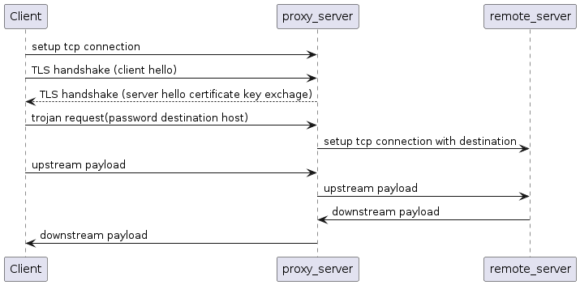

# overplus
Overplus is another implementation of trojan protocol with better perfermance and stability.

[](https://dev.azure.com/overplusProxy/overplus/_build/latest?definitionId=3&branchName=master)

**Compared with trojan**:
- [x] Lower latency and higher speed
- [x] Enhanced Security
- [x] Easy to deploy
- [x] More readable and cleaner code.


## One-click deployment
Run the script and follow the assistant:

``` commandline 
curl -O https://raw.githubusercontent.com/xyanrch/overplus/master/install.sh && chmod +x install.sh && sudo ./install.sh
 ```
 
 **It is strongly recommended to enable BBR to accelerate the network speed.**
 
**[Enable BBR on 20.04 and CentOS 8](https://cloud.tencent.com/developer/article/1946062)**
## Client side
A windows client that support v protocol can find in release page. Overplus fully support trojan protocol, so you can use any client which support trojan protocol. Please make sure disable certificate verification if you use a self issued certificate.


## Build
The project depend on boost and openssl libraries, please make sure install boost and openssl before build the project.

### How to build
``` commandline
mkdir build && cd build
cmake ..
make

```
### How to run

``` commandline
sudo ./overplus -c server.json
```
server.json is a config file which you can customize.

#### Example config file
```json
{
    "run_type": "server",
    "local_addr": "0.0.0.0",
    "local_port": "443",
    "allowed_passwords": [
        "testpsswd"
    ],
    "log_level": "NOTICE",
    "log_dir":"",
    "ssl": {
        "cert": "path_to_cert",
        "key": "path_to_key"
    },
  "websocketEnabled": false
}
```
## Windows platform build
Windows use vcpkg to manage library

**Dowload vcpkg**
```commandline
git clone https://github.com/Microsoft/vcpkg.git
.\vcpkg\bootstrap-vcpkg.bat
```
**Install dependence**
```commandline
.\vcpkg\vcpkg.exe install --triplet x64-windows
```
**Build project**
```commandline
cmake -B build -S . -DCMAKE_TOOLCHAIN_FILE="..\vcpkg\scripts\buildsystems\vcpkg.cmake"
cmake --build build
```
## How does overplus work?
Trojan protocol is a socks5 like protocol.Trojan request is formed as follows:

        +----+-----+-------+------+----------+----------+-------+
        |Command | password| DST.ADDR | DST.PORT |packed payload
        +----+-----+-------+------+----------+----------+-------+
        | unit8  |  string  | string |   string  | string
        +----+-----+-------+------+----------+----------+-------+


## Roadmap
- [x] Support UDP proxy for trojan protocol
- [x] Support websocket for trojan protocol
- [ ] Implement a web console to manage overplus
- [ ] Design a new protocol to replace trojan protocol

## Stargazers over time

[](https://starchart.cc/xyanrch/overplus)

